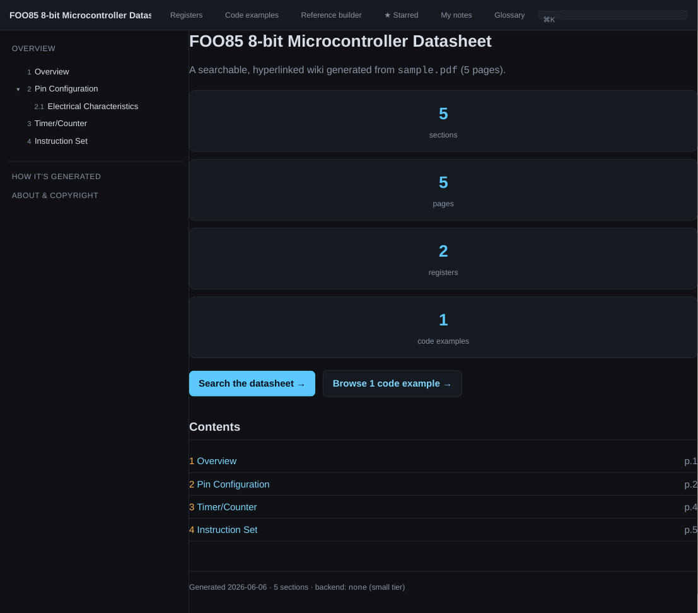
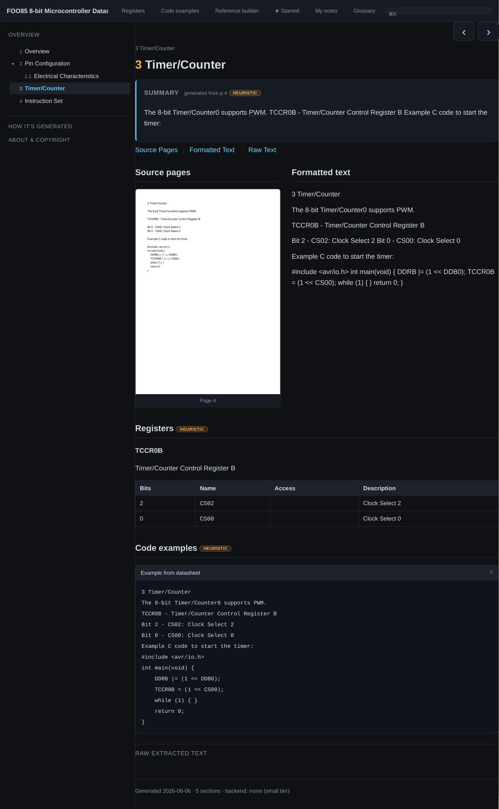
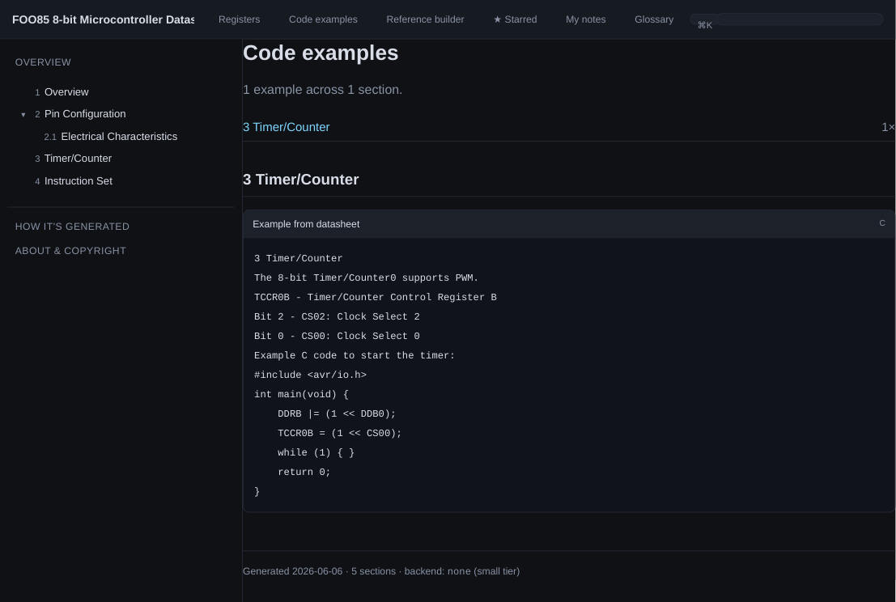

# datasheet-wiki

Turn a microcontroller **datasheet PDF** into a **searchable, hyperlinked,
self-hosted wiki** — with an image of every source page, auto-linked cross
references ("see Section 4.3", "page 42"), detected registers/bit-fields,
**reflowed & formatted text** (headings, bold, bullets, inline figures), and
optional LLM-generated summaries and code examples.

Each section shows a **Formatted text** view — the raw PDF text reflowed into
real paragraphs, figures cropped and embedded inline, and whole-page tables
flagged with a link to the page image. Text recovered from tables and figures
(e.g. a register's `Bit / 7 / 6 / 5 / 4` column) is tucked into a **collapsed
monospace block that shows one line and expands on click**, so it never clutters
the prose. The verbatim extracted text is kept too, in a collapsed "Raw
extracted text" panel.

On the **medium and large (LLM) tiers**, that Formatted text view is produced by
the LLM itself: each page is reflowed into clean HTML, and every detected
**figure and table is embedded as its cropped image** instead of leaving a trail
of scrambled OCR text in the prose (the raw text is still kept, tucked into a
collapsed block). It's resumable and cached per page, falls back to the heuristic
reflow on any page the model can't handle, and is sanitised to a safe tag
allowlist. Toggle it with `--llm-format` / `--no-llm-format`.

Built for everything from the 30-page ATtiny85 datasheet to the 600-page RP2040
datasheet. Parsing can take minutes to hours depending on the tier you pick;
that's fine — you only do it once per datasheet.

> **Copyright-friendly by design.** The tool ships *only code*. You run it on
> *your own* copy of a PDF, on *your own* machine, and the generated wiki stays
> local. Datasheet PDFs and generated sites are git-ignored, so nothing
> copyrighted ever lands in this repo.

## Screenshots

The screenshots below are generated from a small **synthetic** "FOO85" datasheet
(authored for this repo, no copyright) so they can live in version control.

| Overview | Section (registers + code) |
|----------|----------------------------|
|  |  |

A section page: server-rendered section tree (highlighting the current page), an
auto-generated summary with keyword tags, a detected register bit-field table,
a code example, the cleaned-up text, and an image of the original PDF page.

There's also a **Code examples** page (`code.html`) that collects every detected
code example across the whole datasheet into one browsable, linked index:



---

## Why

Manufacturer datasheets are giant PDFs with poor search, no deep links, and no
code. This builds a personal wiki out of one: fast full-text search, a clickable
section tree, the original page images side-by-side with cleaned-up text, and —
if you want — AI summaries and usage examples. Host it locally, link to it, grep
it, keep it forever.

## Tools for embedded engineers

Beyond the per-section pages, every generated wiki includes:

- **Register map** (`registers.html`) — every detected register in one place, each
  with an **interactive bit-field calculator**: tick field values to get the
  register's hex/binary, or paste a hex value to decode it back into fields.
- **Reference builder** (`reference.html`) — make a printable thumbnail cheat-sheet
  from any pages (`1, 3, 5-8, 12`); a built-in **page search** finds page numbers
  by keyword so you can add them, and the result is shareable via URL.
- **Personal Reference** (`starred.html`) — ★ any source page and it lands in a
  thumbnail gallery (adjustable thumbnail size), saved in your browser per
  datasheet.
- **Code examples** index, **full-text search**,
  an **image lightbox**, and heading **permalinks**.

All of these run entirely client-side and work offline.

## Three compute tiers (incl. fully local, no API)

| Tier | Backend | What you get | Needs |
|------|---------|--------------|-------|
| **small** | none (heuristics) | Page images, full-text search, auto cross-reference links, register/bit-field detection, code-block detection. **No LLM, runs on any laptop in minutes.** | nothing extra |
| **medium** | **local LLM via [Ollama](https://ollama.com)** | Everything in small **+** per-section plain-English summaries, **LLM-formatted pages** (clean HTML with figures/tables as images), structured register extraction, generated code examples, **+ a local embedding index** (for the planned Q&A). **Nothing leaves your machine.** | `ollama` + `uv sync --extra local` |
| **large** | **Claude API** | Highest-quality summaries, LLM-formatted pages, register extraction, and code examples. | `uv sync --extra api` + `ANTHROPIC_API_KEY` |

The cross-reference linking, register/code detection, page images, and full-text
search are **always** available — even in the no-LLM `small` tier — because they
come from parsing the PDF itself (text, the table of contents, and the
hyperlinks the datasheet authors already embedded).

---

## Quickstart

Uses [uv](https://docs.astral.sh/uv/) (`curl -LsSf https://astral.sh/uv/install.sh | sh`).

```bash
git clone https://github.com/nro-bot/claude_datasheet_wiki
cd claude_datasheet_wiki
uv sync                                # creates .venv and installs the CLI

# Build (small tier, no LLM, fast):
uv run datasheet-wiki build path/to/attiny85.pdf

# Serve it locally:
uv run datasheet-wiki serve wiki/attiny85
# → http://127.0.0.1:8000
```

`uv run` auto-syncs the environment, so the first command bootstraps everything.
(Prefer an activated venv? `source .venv/bin/activate` and drop the `uv run`
prefix. Prefer plain pip semantics? `uv pip install -e .` works too.)

No PDF handy? Generate a tiny synthetic one to see the whole thing work:

```bash
uv run python tests/make_sample_pdf.py sample.pdf
uv run datasheet-wiki build sample.pdf -o wiki/sample
uv run datasheet-wiki serve wiki/sample
```

### Medium tier (local LLM, nothing leaves your machine)

```bash
uv sync --extra local
ollama pull llama3.1          # or qwen2.5, mistral, phi3 …
uv run datasheet-wiki build rp2040.pdf --compute medium --model llama3.1
```

GPU acceleration is handled by **Ollama itself**, not this tool — it uses Metal
(MPS) on Apple Silicon, CUDA on NVIDIA, or ROCm on AMD automatically, with no
configuration. This tool is just an HTTP client to the local Ollama server, so it
never changes the inference backend. To confirm the GPU is being used while a
build runs, check `ollama ps` (it shows e.g. `100% GPU`) or the `ollama serve`
logs. To tune offloading, set Ollama's own env vars (e.g. `OLLAMA_NUM_GPU`)
before `ollama serve`.

### Large tier (Claude API)

```bash
uv sync --extra api
export ANTHROPIC_API_KEY=sk-ant-...
uv run datasheet-wiki build rp2040.pdf --compute large
# For a 600-page datasheet with thousands of sections, a cheaper model saves a lot:
uv run datasheet-wiki build rp2040.pdf --compute large --model claude-haiku-4-5
```

---

## CLI

```
datasheet-wiki build  <pdf> [-o OUT] [-c {small,medium,large}] [options]
datasheet-wiki serve  <dir> [-p PORT]
datasheet-wiki info   <pdf> [--limit N]      # print the PDF outline & page count
```

Useful `build` options:

| Option | Effect |
|--------|--------|
| `--compute {small,medium,large}` | Pick a tier (default `small`). |
| `--backend {none,ollama,anthropic}` | Override the tier's backend. |
| `--model NAME` | LLM model id (Ollama or Claude). |
| `--dpi N` | Page-image resolution (tier default 120/150/200). |
| `--svd FILE` | Use a CMSIS-SVD file as the authoritative register source (register map + `device.h`). |
| `--llm-format` / `--no-llm-format` | Turn the LLM-formatted page view on/off (on by default for medium/large). |
| `--semantic` | Build a local embedding index (needs `[local]` extra; for the planned Q&A). |
| `--no-images` | Skip page images (smaller, faster). |
| `--max-pages N` | Only process the first N pages — great for a quick test on a 600-page PDF. |
| `--no-resume` | Ignore caches and rebuild from scratch. |

---

## How it works

```
PDF ─┬─ render every page → images/            (PyMuPDF)
     ├─ extract text + table of contents + embedded hyperlinks
     ├─ build a section tree from the outline
     ├─ enrich each section  ──►  none | ollama | anthropic   (cached to disk)
     ├─ (LLM tiers) reflow each page → clean HTML, figures/tables as images
     ├─ build full-text search index (+ optional local embeddings)
     └─ render a static site (Jinja2)  →  index.html, sections/, search.html
```

- **Resumable.** Page rendering and per-section enrichment are cached in
  `.dsw-cache/`, keyed by content. Interrupt a multi-hour RP2040 run and
  re-run — it picks up where it left off.
- **Fully static output.** The wiki is plain HTML/CSS/JS with no build step and
  no server requirement. The search index and nav are emitted as JS globals, so
  search even works when you open the files directly (`file://`), not just via
  `datasheet-wiki serve`.
- **Cross-reference linking** turns "see Section 4.3", "Table 10-1", and
  "page 42" into real wiki links, with zero LLM calls.

## Output layout

```
wiki/<name>/
├── index.html              # overview + stats + table of contents
├── search.html             # client-side full-text search
├── about.html              # provenance + copyright notice
├── sections/<id>.html      # one page per datasheet section
├── images/page-NNNN.png    # rendered source pages
├── data/search-index.js    # prebuilt search index (JS global)
└── assets/                 # css + js + nav.js
```

## Requirements

- Python 3.9+
- Core: `PyMuPDF`, `Jinja2` (installed automatically).
- `[local]` extra: `sentence-transformers`, `numpy` (medium-tier embedding index).
- `[api]` extra: `anthropic` (large tier).

## Hosting your own datasheet wiki

Each person processes their own legally-obtained PDF locally. To keep a wiki
around, just keep the generated `wiki/<name>/` directory — it's self-contained.
Serve it with `datasheet-wiki serve`, any static file server, or open
`index.html` directly. **Do not commit datasheet PDFs or generated wikis to a
public repo** (the included `.gitignore` blocks them by default).

## Development

```bash
uv sync --extra dev
uv run pytest
```

## License

MIT — see [LICENSE](LICENSE). The license covers the generator code only, not
any datasheet you process with it.
